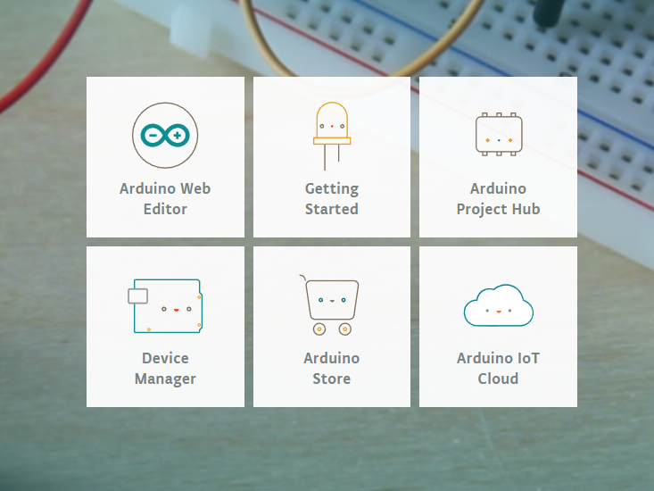
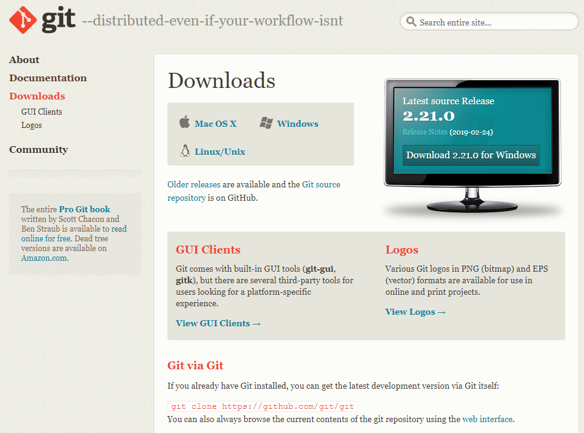
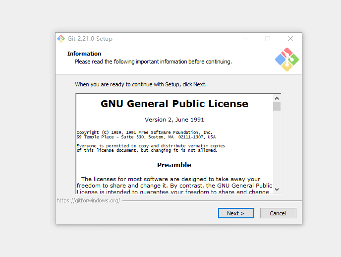
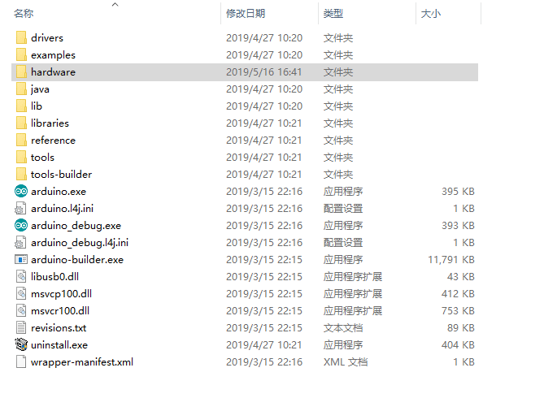

***************
入门使用篇
***************

1. 引言
============

欢迎来到Arduino！在您开始编程之旅之前，您需要设置软件

以编写您的电路板Arduino软件（IDE）允许您编写程序并将其上传到您的电路板。在Arduino Software页面中，您将找到两个选项：

1. 如果您有可靠的Internet连接，则应使用在线IDE（Arduino Web Editor）。它允许您将草图保存在云中，从任何设备上获取它们并备份。您将始终拥有最新版本的IDE，而无需安装更新或社区生成的库。

2. 如果您希望脱机工作，则应使用最新版本的 `桌面IDE <https://www.arduino.cc/en/Main/Software?setlang=cn>`_ 

.. important:: 强烈建议安装桌面版IDE。当然，有机会你也可以尝试使用在线版IDE

..
 .. image:: ../../_static/das.gif
 
 

2. Arduino的安装
=================

.. toctree::
    :hidden:
    
    2.1 Windows <windows-setup>
    2.2 Linux <linux-setup> 
    2.3 MacOS <macos-setup>

=============

+-------------------+-------------------+-------------------+
| |windows-logo|    | |linux-logo|      | |macos-logo|      |
+-------------------+-------------------+-------------------+
| `Windows`_        | `Linux`_          | `Mac OS`_         |
+-------------------+-------------------+-------------------+

.. |linux-logo| image:: ../_static/linux-logo.png
    :target: ../basics/linux-setup.html

.. |macos-logo| image:: ../_static/macos-logo.png
    :target: ../basics/macos-setup.html

.. _Windows: ../basics/windows-setup.html
.. _Linux: ../basics/linux-setup.html
.. _Mac OS: ../basics/macos-setup.html

3. Arduino-ESP32的搭建
=======================

请根据下方详细步骤，完成安装过程。

设置开发环境
~~~~~~~~~~~~

* :ref:`basics-install-git`
* :ref:`basics-build-config`
* :ref:`basics-git-clone`
* :ref:`basics-setup-toolchain`

.. _basics-install-git:

3.1 安装Git
=======================

下载步骤：
~~~~~~~~~~~~~

从 `Git官网 <https://git-scm.com/downloads>`_ 下载安装包Git.exe

操作步骤：
~~~~~~~~~~~~~

下载完成后，双击打开，
一直点击下一步，直到完成。

   安装过程

检验步骤：
~~~~~~~~~~~~~
安装完毕后，点击一下鼠标右键。就会看到 **Git Bash Here** ，
说明已经安装成功了，
我们稍后要用到这个软件，

.. _basics-build-config:

3.2 搭建前配置
=======================

.. figure:: ../_static/git_clone1.png 
   :scale: 100
   :align: center

   打开Arduino所在文件夹
.. note::

    点击图标，然后右键选择 ``打开文件夹所在的位置`` 

操作步骤：
~~~~~~~~~~~~~

* 选择 **hardware** -> 
* 鼠标 **右键** -> 
* 点击 **Git Bash Here**

* ``hardware``：Arduino存放所支持硬件的文件夹
* ``Git Bash Here``：可以在当前所在文件夹打开Git Bash终端

.. _basics-git-clone:  

3.3 克隆远程仓库
=================

这一过程的目的，是从GitHub网站上克隆远程仓库

为了使搭建过程更加简便，以及防止出现文件不齐全的问题，所以这里不宜使用直接下载zip。

建立文件夹： 
~~~~~~~~~~~~

.. code-block:: bash

    mkdir espressif
     
进入文件夹：
~~~~~~~~~~~~

.. code-block:: bash

    cd espressif

.. note::

    - ``mkdir``：make directory,程序功能->建立一个文件夹 
    - ``espressif``：乐鑫英文名字，ESP32、ESP8266等设备都设定在此文件夹下
    - ``cd``：change directory,程序功能->改变当前路径

    bash是一种shell，而 ``mkdir`` ``cd`` 是bash内置的使用命令 

克隆远程仓库：
~~~~~~~~~~~~~~~~~~~~~~~~~~

.. code-block:: bash

    git clone --recursive https://github.com/espressif/arduino-esp32.git esp32

.. note::

    - ``git clone``：git操作指令之一，克隆远程仓库
    - ``--recursive``：git操作指令之一，可直接下载仓库子模块
    - ``esp32``：在链接后方写明 ``esp32`` ,可直接更改所克隆仓库文件夹名称,默认为Arduino-esp32

    这里须设为esp32,是因为arduino开启时会默认读取 ``arduino/hardware/espressif/esp32``

演示视频
~~~~~~~~~~~~~

.. figure:: ../_static/git_clone3.gif 
   :scale: 100
   :align: center

.. _basics-setup-toolchain:
 
3.4 安装编译工具链
=====================

接下来要安装esptool，编译工具链等工具

**恭喜，这是arduino-esp32搭建的最后一步了，胜利在望！**

我们只要点击get.exe，脚本就会自动帮我们下载工具。

操作步骤
~~~~~~~~~~~~
- 进入 ``arduino/hardware/espressif/esp32``
- 点击 ``tools`` 
- 双击 ``get.exe`` 自动下载依赖包
- 等待下载，下载完成后cmd自动关闭

演示视频
~~~~~~~~~~~~

