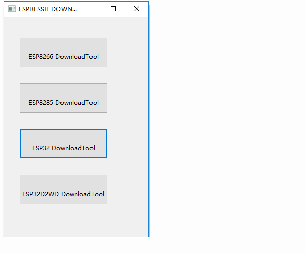
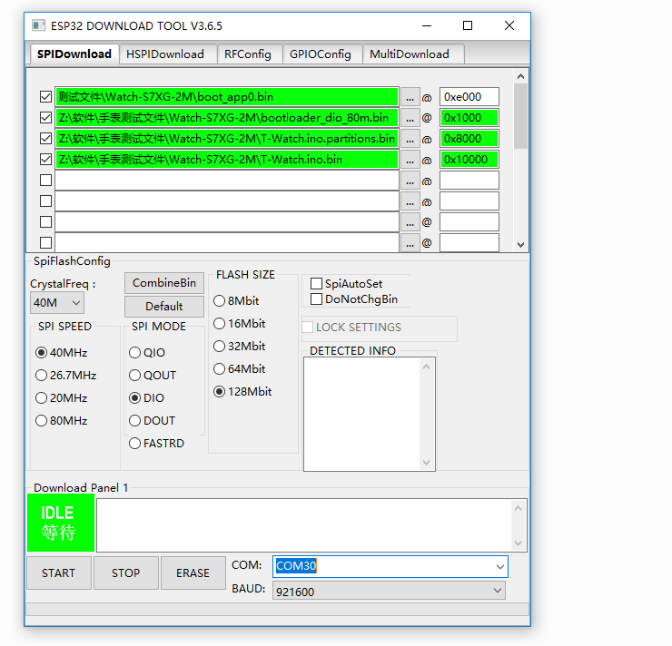
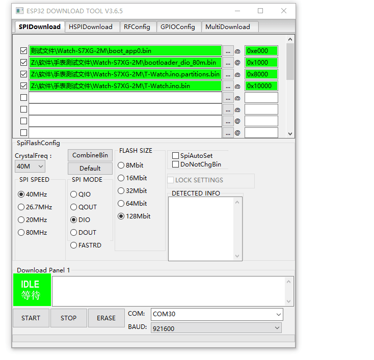

=============
快速上手
=============

本文档旨在指导用户如何使用T-Wath

.. figure:: ../../_static/get_started1.jpg
   :scale: 100
   :align: center

恢复出厂程序
=============

设置操作环境
+++++++++++++
* :ref:`get-stared-build`
* :ref:`get-stared-config`
* :ref:`get-stared-download`
* :ref:`get-stared-use`

.. _get-stared-build:

1. 环境搭建
==============

安装Flash Download Tools 
+++++++++++++++++++++++++

乐鑫烧录下载工具ESP Flash Download Tool: :download:`Download <https://www.espressif.com/sites/default/files/tools/flash_download_tools_v3.6.5_0.zip>`
  

安装CP2104驱动
++++++++++++++++

* :download:`CP2104-Win10 <https://www.silabs.com/documents/public/software/CP210x_Universal_Windows_Driver.zip>`

下载固件
++++++++++++++++

安装固件可到 :ref:`资源下载/固件<firmware_download>` 中获取。

.. _get-stared-config:

2. 下载设置
==============

``ESP Flash Tool`` 设置操作见下：

* ``COM``：烧录设备端口选择，如只有一个设备，可直接选择。
* ``BAUD``：下载波特率，建议921600
* ``SPI SPEED``：40MHz
* ``SPI MODE``：DIO
* ``FLASH SIZE``：128Mbit

============================= =========================================================   
 文件                          地址                                                   
============================= =========================================================    
 boot_app0.bin                    0xe000
 bootloader_dio_80m.bin           0x1000
 T-Watch.ino.partitions.bin       0x8000
 T-Watch.ino.bin                  0x10000
============================= =========================================================   

.. _get-stared-download:

3. 下载固件
==============

.. important::
    请等待界面左下角显示Finish（完成）时，再关闭软件。

.. _get-stared-use:

4. 正常使用
==============

