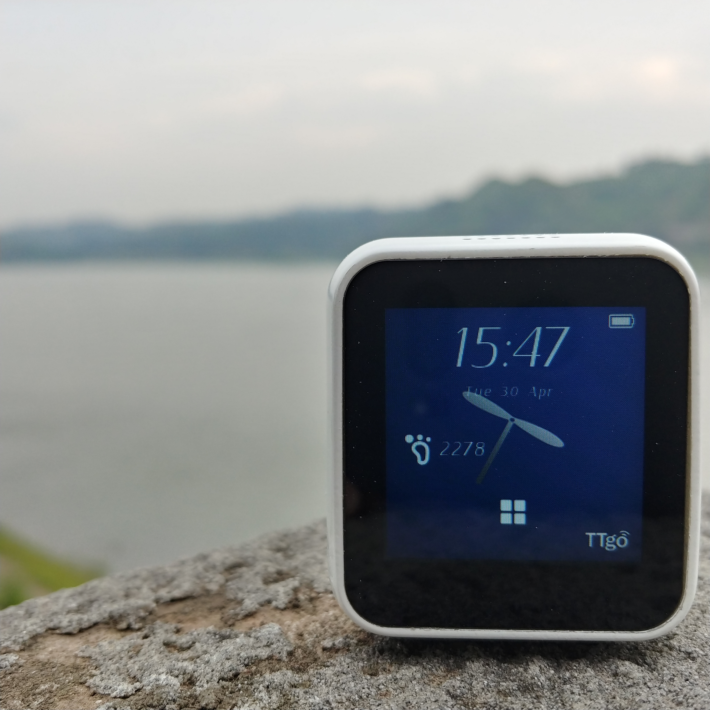

.. Arduino 编程指南 documentation master file, created by
   sphinx-quickstart on Fri Apr 19 14:10:11 2019.
   You can adapt this file completely to your liking, but it should at least
   contain the root `toctree` directive.

T-Watch 编程文档
=================

T-Watch 可编程智能手表是深圳芯元电子最新推出的一款自主开发产品。

这里是芯元电子(Arduino) 的编程指南文档。Arduino 是 ESP32 芯片的一种特别常用的开发环境。

==================  ==================  ==================
|简介|_              |快速上手|_         |入门使用篇|_
------------------  ------------------  ------------------
`简介`_              `快速上手`_         `入门使用篇`_
------------------  ------------------  ------------------
|进阶开发篇|_          |下载资源|_         |相关链接|_
------------------  ------------------  ------------------
`进阶开发篇`_          `下载资源`_         `相关链接`_
==================  ==================  ==================

.. _简介: introduction/index.html

.. |快速上手| image:: _static/api-reference.gif 
.. _快速上手: get-started/index.html

.. |入门使用篇| image:: _static/hw-reference.gif
.. _入门使用篇: basics/index.html

.. |进阶开发篇| image:: _static/api-guides.gif
.. _进阶开发篇: advanced/index.html

.. |下载资源| image:: _static/contribute.gif
.. _下载资源: download/index.html

.. |相关链接| image:: _static/resources.gif
.. _相关链接: related-links/index.html

.. toctree::
   :hidden:

   1.简介 <introduction/index> 
   2.快速上手 <get-started/index>
   3.入门使用篇 <basics/index>
   4.进阶开发篇 <advanced/index>
   5.下载资源 <download/index>
   6.相关链接 <related-links/index>

Indices and tables
>>>>>>>>>>>>>>>>>>

* :ref:`genindex`
* :ref:`modindex`
* :ref:`search`
