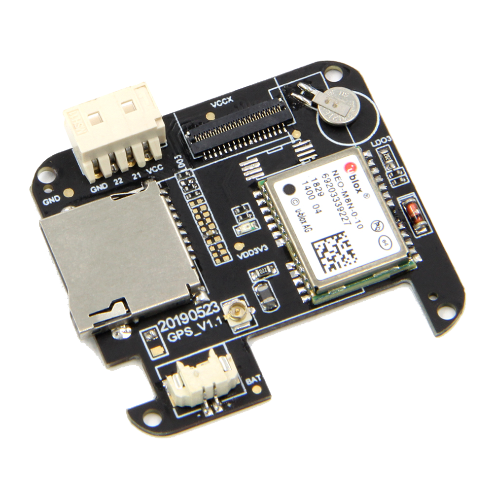

==================
T-Watch GPS
==================

1.描述
==================

T-Watch GPS是一款基于ESP32的可编程手表套件，由Core PCB和GPS-M8N底板组成。
您甚至可以通过Arduino,ESP-IDF或MicroPython对T-Watch SIM800L进行编程。

.. image:: ../_static/model4.jpg

2.特征
==================

- 主芯片：ESP32，双核MCU（集成双模蓝牙/wifi ），PMU电源管理
- 显示屏：1.54寸LCD电容触摸屏
- 传感器：BMA423三轴加速度计，内置计步算法，活动识别/跟踪，高级手势识别等功能
- 组合套件：锂电池，设计开模，以及粗线表带，并且有黑、白双色
- 开发平台：ESP-IDF(原生SDK)，Arduino,Lua,MicroPython,Scratch
- 支持 **GPS定位** 功能：*经纬度、海拔高度* 数据获取
- 支持 **TF卡读写** 
- 支持可拓展模块使用

3.引脚详情
==================

屏幕
++++++++++++++++++
=============== ======  ====================================  
 ESP32           属性     描述
=============== ======  ====================================
 GPIO05           CS      TFT_CS
 GPIO18           SCLK    TFT_SCLK
 GPIO19           MOSI    TFT_MOSI
 GPIO27           DC      TFT_DC
 GPIO12           BL      TFT_BL
=============== ======  ==================================== 

TF卡
+++++++++++++++++
=============== ======  ====================================  
 ESP32           属性     描述
=============== ======  ====================================
 GPIO13          CS        TF_CS
 GPIO15          MOSI      TF_MOSI
 GPIO02          MISO      TF_MISO
 GPIO14          SCLK      TF_SCLK
=============== ======  ====================================

NEO GPS M8N
+++++++++++++++++
=============== ======  ====================================  
 ESP32           属性     描述
=============== ======  ====================================
 GPIO33           TX      UART_GPS_TX 
 GPIO34           RX      UART_GPS_RX
=============== ======  ====================================

4.演示程序
==================

 - `Github源码 <https://github.com/Xinyuan-LilyGO/TTGO-T-Watch>`_

