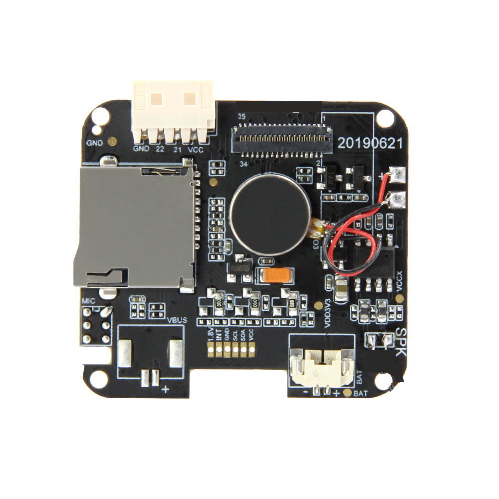
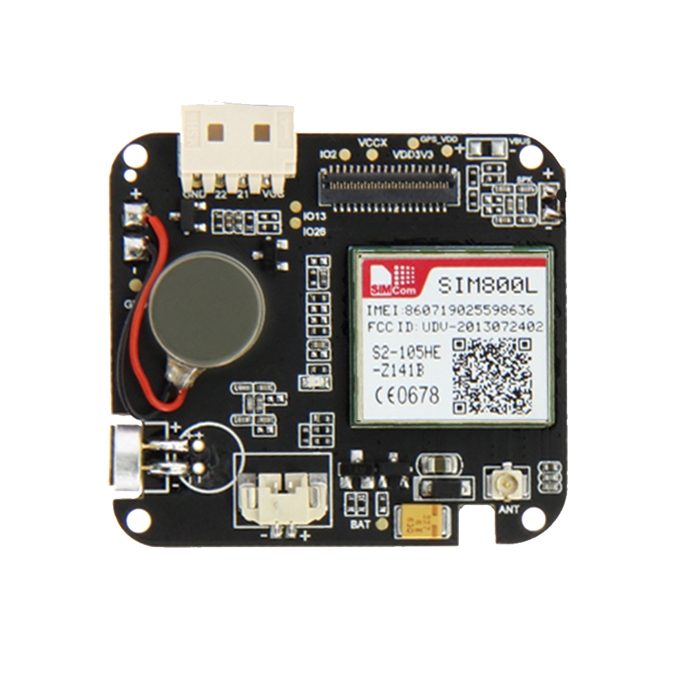
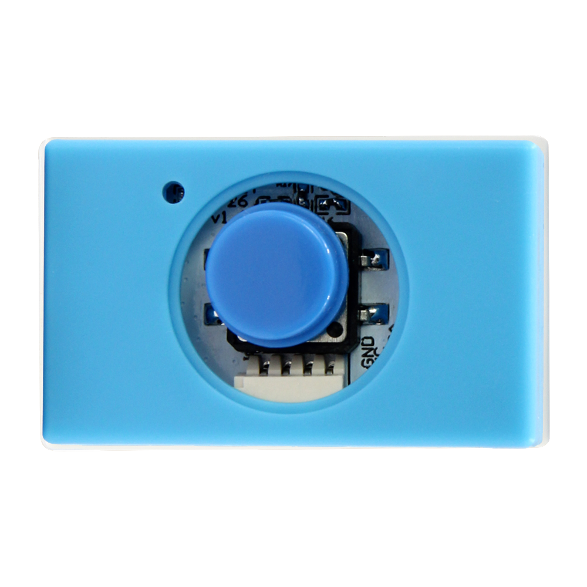
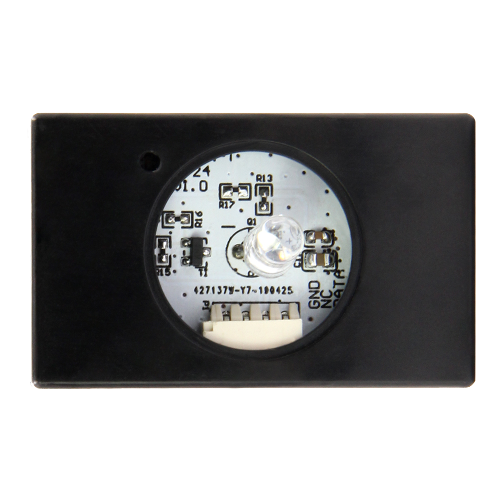
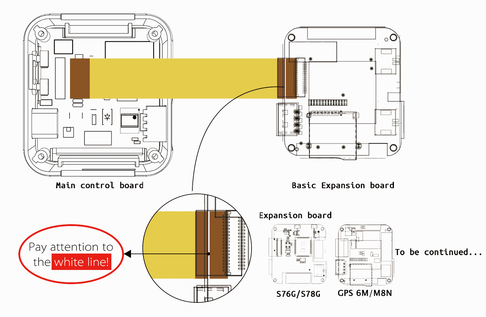

==============
T-Watch简介
==============

.. image:: ../_static/image3.jpg

产品分类
==============

==================  ==================  =====================
|Standard|_           |SIM800L|_         |GPS|_
------------------  ------------------  ---------------------
`Standard`_           `SIM800L`_         `GPS`_
------------------  ------------------  ---------------------
|MPR121|_              |Lora+GPS|_      |Standard+Max30102|_
------------------  ------------------  ---------------------
`MPR121`_              `Lora+GPS`_      `Standard+Max30102`_
==================  ==================  =====================

.. _Standard: ../introduction/standtrd.html

.. |MPR121| image:: ../_static/basic011.png
.. _MPR121: ../introduction/mpr4.html

.. _SIM800L: ../introduction/sim02.html

.. |GPS| image:: ../_static/GPS3.png
.. _GPS: ../introduction/gps8m03.html

.. _Lora+GPS: ../introduction/s76g05.html

.. |Standard+Max30102| image:: ../_static/std11.png
.. _Standard+Max30102: ../introduction/sg06.html

配套模块
==============

==================  ==================  ==================
|按键模块|_          |蜂鸣器模块|_         |WS2812_RGB|_
------------------  ------------------  ------------------
`按键模块`_          `蜂鸣器模块`_         `WS2812_RGB`_
------------------  ------------------  ------------------
|DHT12模块|_        |Pir红外传感器|_      |光敏模块|_
------------------  ------------------  ------------------
`DHT12模块`_        `Pir红外传感器`_      `光敏模块`_
------------------  ------------------  ------------------
|红外发送模块|_       |红外接收模块|_       |敬请关注后续|_
------------------  ------------------  ------------------
`红外发送模块`_       `红外接收模块`_       `敬请关注后续`_
==================  ==================  ==================

.. _按键模块: ../introduction/button1.html

.. _蜂鸣器模块: ../introduction/buzzer2.html

.. |DHT12模块| image:: ../_static/dht3.png
.. _DHT12模块: ../introduction/dht3.html

.. |WS2812_RGB| image:: ../_static/rgb4.png
.. _WS2812_RGB: ../introduction/rgb4.html

.. |Pir红外传感器| image:: ../_static/pir5.png
.. _Pir红外传感器: ../introduction/pir5.html

.. _光敏模块: ../introduction/photo6.html

.. _红外发送模块: ../introduction/send7.html

.. _红外接收模块: ../introduction/receive8.html

.. |敬请关注后续| image:: ../_static/tobe06.png
.. _敬请关注后续: ../introduction/tobe06.html

硬件概述
==============

类别
--------------

* :ref:`technical-parameters`
* :ref:`appearance-specification`
* :ref:`component-layout`
* :ref:`pin-definition`

.. _technical-parameters:

1.技术参数
==============

- T-Watch板载：

  - 主芯片：ESP32
  - 1.54寸LCD电容触摸屏:ST7789V
  - 触摸屏芯片：FT6236U
  - 三轴加速度计:BMA423
  - PMU电源管理：AXP202
  - RTC时钟模块：PCF8563

.. figure:: ../_static/get_started2.jpg 
   :scale: 40
   :align: center

- **ESP-32** 主控：

  - CPU：Xtensa双核32位LX6微处理器，工作频率为240 MHz，最高可达600 DMIPS
  - 超低功耗（ULP）协处理器
  - 内存：520 KiB SRAM
  - 无线连接：
  - Wi-Fi：802.11 b / g / n
  - 蓝牙：v4.2 BR / EDR和BLE
- 供电方式：Type-C USB/锂电池
- 工作电压：3.3V

.. note::
  
  ESP32 由总部位于上海的中国公司乐鑫信息科技创建和开发，由台积电采用40纳米技术制造。
  它是ESP8266微控制器的后继产品。

开机演示视频
--------------
.. figure:: ../_static/gif4.gif 
   :scale: 100
   :align: left

界面切换视频
--------------
.. figure:: ../_static/gif5.gif 
   :scale: 100
   :align: left

.. _appearance-specification:

2.外观规格
==============

.. image:: ../_static/model1.jpg

.. _component-layout:

3.元件布局
==============

.. image:: ../_static/model2.jpg

.. _pin-definition:

4.引脚定义
==============

.. image:: ../_static/model4.jpg
