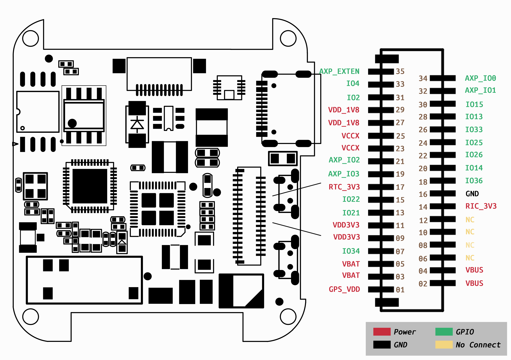

==============
T-Watch简介
==============

产品简介
==============

.. toctree::
   :maxdepth: 1

   介绍 <introduce>

============== 

硬件概述
==============

类别
--------------

* :ref:`technical-parameters`
* :ref:`appearance-specification`
* :ref:`component-layout`
* :ref:`pin-definition`

.. _technical-parameters:

1.技术参数
==============

该板具有以下硬件特性:

  - ESP-32主控：

    - 处理器：Tensilica LX6双核处理器（一核处理高速连接；一核独立应用开发）
    - 主频：高达240MHz的时钟频率
    -	SRAM：520KB
    - Flash：8MB
    - Wi-Fi标准：FCC/CE/TELEC/KCC
    - Wi-Fi协议：802.11 b/g/n/d/e/i/k/r (802.11n，速度高达150 Mbps)，A-MPDU和A-MSDU聚合，支持0.4us防护间隔
    - 频率范围：2.4~2.5 GHz
    - 蓝牙协议：符合蓝牙v4.2 BR/EDR和BLE标准
    - 蓝牙音频：CVSD和SBC音频低功耗：10uA

  - 供电方式：Type-C USB供电
  - 工作电压：3.3V
  - 最大工作电流:200mA
  - T-Watch板载：

    - 1.54寸LCD电容触摸屏:ST7789V
    - GPS通讯模块：NEO M8N/6M
    - 三轴加速度计:BMA423
    - CMU电源管理：AXP202
    - Lora模块：SX1276

  - 拓展接口：

    - 2个数字I/O：GPIO25，GPIO26 (支持ADC,DAC)
    - 支持I2C、UART、SPI通讯协议

.. _appearance-specification:

2.外观规格
==============

.. image:: ../_static/model1.jpg

.. _component-layout:

3.元件布局
==============

.. image:: ../_static/model2.jpg

.. image:: ../_static/model3.jpg
.. _pin-definition:

4.引脚定义
==============

