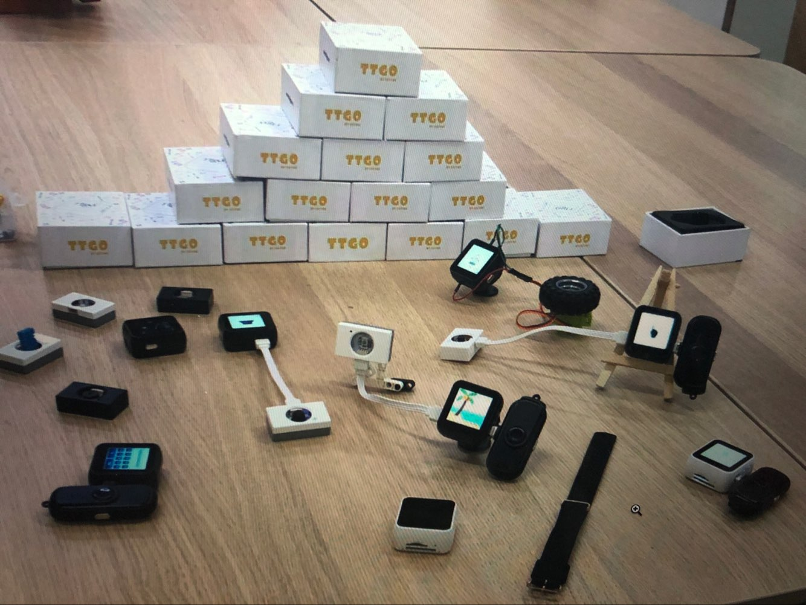

**************
T-Watch简介
**************

背景
********

随着近两年智能家居、IOT发展的如火如荼，不仅是计算机，物联网还涉及智能手机和家用电器，以及智能手环，手表跟我们生活息息相关的物品和设备。目前这些智能手表、手环来说，功能都大同小异，智能手环普遍主要在于记录运动数据、消息推送、来电提醒、心律监测等。而智能手表来说可能功能就更丰富些，表盘的变换、支持通话、GPS定位、拍照录音、线下支付等一些智能手机的功能。而我们的这款产品却与众不同，T-Watch是一款可编程智能手表！

为什么要可编程？
***********************

为什么手表要支持可编程？为什么我们很多人都在要学习编程？为什么欧美发到国家的孩子更具有创造力，想象力。

Scratch之父曾这么评价现代学子：“世上有两种学生，一种是“A型学生”即从小学到高中一直都学习很好，而尽管A型学生考试 成绩很好，却按部就班，并不具备在当今社会取得成功所必需的创造力和创新能力。

另一种则是“X型学生”。“X型学生” 愿意冒险，勇于尝试新鲜事物；他们渴望提出自己的问题，而不是简单地解决教科书里的问题。”

随着科技的发展，X型人才需求会越来越大。所以学习编程是重中之重的。兴趣是最好的老师，我们通过T-Wathch可编程智能手表作为变成平台及媒介，搭配Scratch,micropython等热门编程语言。大大降低了学习编程的门槛。

产品功能
**************

- 主芯片：ESP32，双核MCU（集成双模蓝牙/wifi ），PMU电源管理
- 显示屏：1.54寸LCD电容触摸屏
- 传感器：BMA423三轴加速度计，内置计步算法，活动识别/跟踪，高级手势识别等功能
- GPS模块：使用索尼 CXD5603GF模块，快速定位当前位置
- Lora模块：新一代流行无线通信技术
- 组合套件：锂电池，设计开模，以及粗线表带，并且有黑、白双色
- 开发平台：ESP-IDF(原生SDK)，Arduino,Lua,MicroPython,Scratch

售后服务
**************

- 优质的技术支持
- 完全开源硬件 软件
- 独立的社区交流平台
- 详情权威的学习资料
- 功能：
  - 
  - 支持SIM卡
  - 支持TF卡
  - 支持麦克风
  - 支持喇叭
  - 支持可拓展模块使用