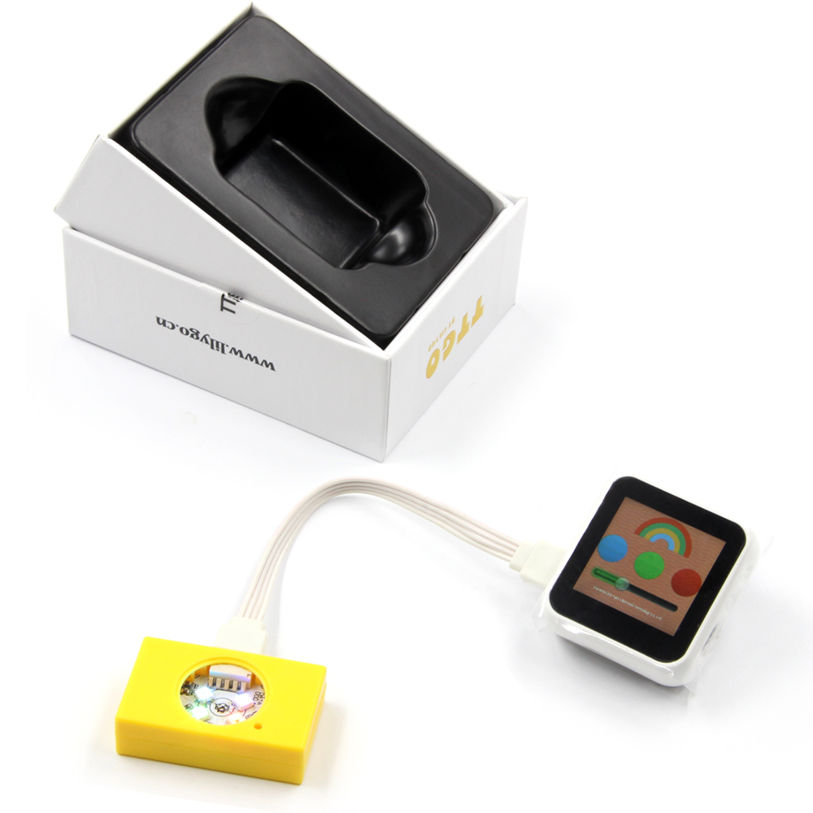

WS2812 RGB模块
================

1.引脚详情
+++++++++++++++++
=============== =========  ====================================  
 ESP32             属性            描述
=============== =========  ====================================
 GPIO25           1-Wire         WS2812
=============== =========  ====================================

2.固件
+++++++++++++++++

 - `Github源码 <https://github.com/Xinyuan-LilyGO/twatch-series-modules/tree/master/twatch_heart_rate/>`_
 - `编译后bin文件 <https://github.com/Xinyuan-LilyGO/twatch-series-modules/tree/master/twatch_heart_rate/>`_

3.手册
+++++++++++++++++

    * :download:`WS2812 <https://cdn-shop.adafruit.com/datasheets/WS2812B.pdf>`
