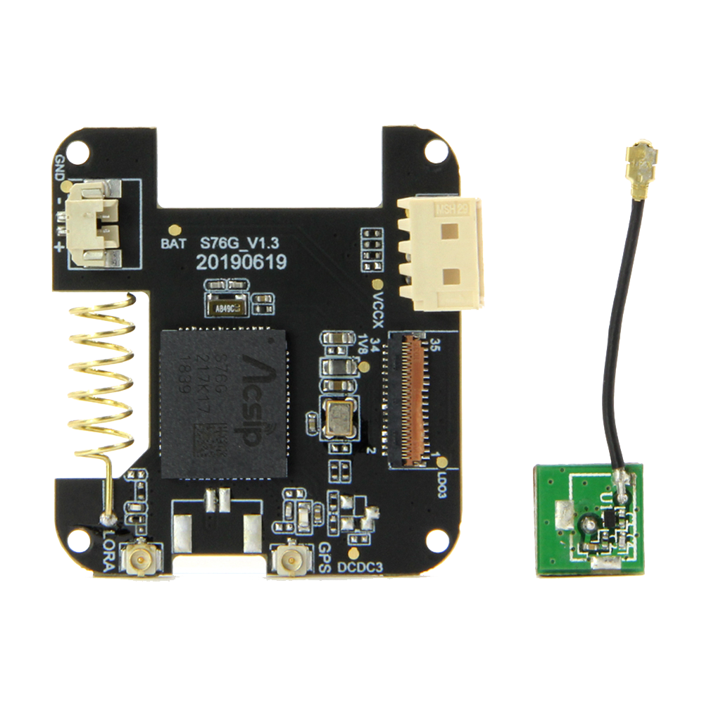

==================
T-Watch S7XG
==================

1.描述
==================

T-Watch S76G是一款基于ESP32的可编程手表套件，由Core PCB和S76G底板组成。
您甚至可以通过Arduino,ESP-IDF或MicroPython对T-Watch SIM800L进行编程。
S76G同时兼有Lora，GPS功能

.. image:: ../_static/model4.jpg

2.特征
==================

- 主芯片：ESP32，双核MCU（集成双模蓝牙/wifi ），PMU电源管理
- 显示屏：1.54寸LCD电容触摸屏
- 传感器：BMA423三轴加速度计，内置计步算法，活动识别/跟踪，高级手势识别等功能
- 组合套件：锂电池，设计开模，以及粗线表带，并且有黑、白双色
- 开发平台：ESP-IDF(原生SDK)，Arduino,Lua,MicroPython,Scratch
- 支持 **GPS** 功能
- 支持 **Lora** 传输
- 支持可拓展模块使用

3.引脚详情
==================

屏幕
++++++++++++++++++
=============== ======  ====================================  
 ESP32           属性     描述
=============== ======  ====================================
 GPIO05           CS      屏幕,TFT_CS
 GPIO18           SCLK    屏幕,TFT_SCLK
 GPIO19           MOSI    屏幕,TFT_MOSI
 GPIO27           DC      屏幕,TFT_DC
 GPIO12           BL      屏幕,TFT_BL
=============== ======  ==================================== 

S76G
+++++++++++++++++
=============== ======  ====================================  
 ESP32           属性     描述
=============== ======  ====================================
 GPIO33           TX      UART_GPS_TX 
 GPIO34           RX      UART_GPS_RX
=============== ======  ====================================

4.演示程序
==================

 - `Github源码 <https://github.com/Xinyuan-LilyGO/twatch-series-modules/blob/master/twatch_s7xg/twatch_s7xg.ino>`_